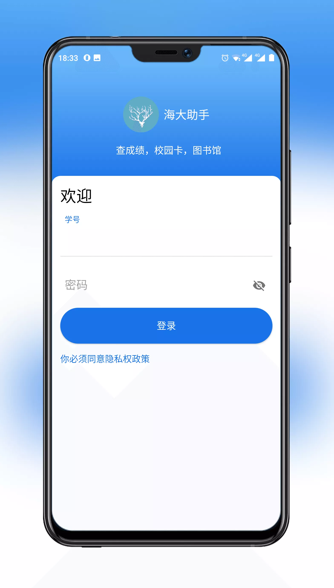
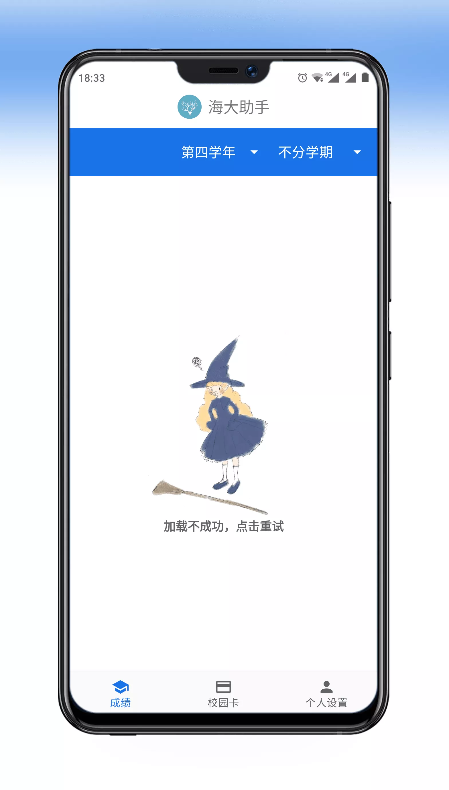
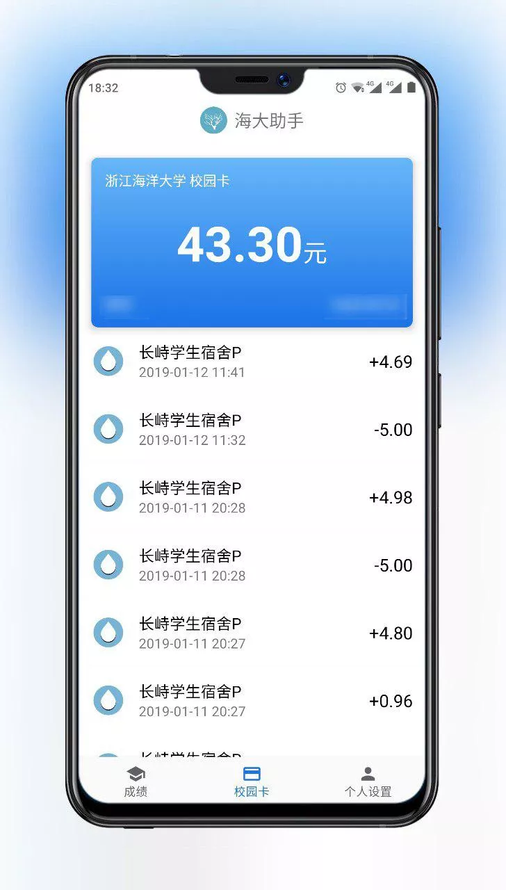
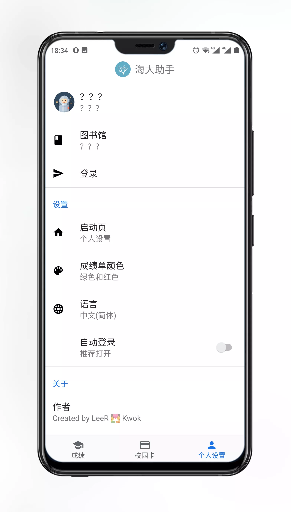

# Grain(海大助手)

> 诞生于 2017-09-06，重生于 2019-01-25

浙江海洋大学校园应用。

目前提供成绩查询、校园卡查询]和图书借阅查询功能

UI 设计参考 [Material Design 2](https://material.io/design/)，感谢@番茄星人总是乐此不彼地提出的改进意见(:3」∠❀)_

**个人开发,与学校无关 。登录账号为学号，密码默认为身份证后八位**

## 下载

- [GitHub](https://github.com/LeeReindeer/Grain/releases)
- [应用主页下载](https://www.pgyer.com/grain2)

## 截图

|  |  |
| -------------------- | ------------------------------- |
|  |      |

## Open source license

- 图标绘制：@番茄星人
- 空视图女巫：@番茄星人
- Andoird Jetpack
- Rxjava2
- OkHttp
- see more at [build.gradle](https://github.com/LeeReindeer/Grain/blob/0d57fcdfac9dd74bce0eaaf06f5fcca73d4dbcb2/app/build.gradle#L30)